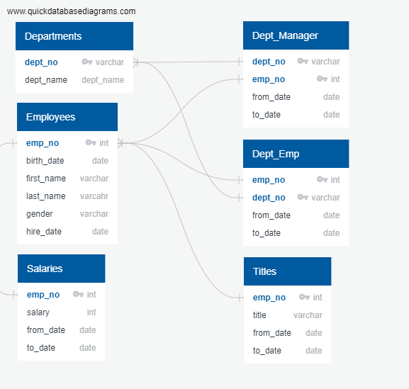
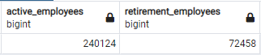
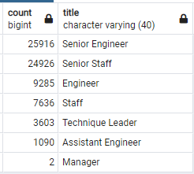
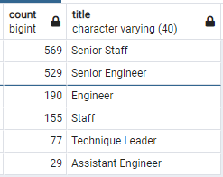

# Pewlett-Hackard-Analysis

## Overview of Project
As baby boomers begin to rapidly retire Pewlett Hackard is looking toward the future. They need to determine which positions will need to be filled in the near future. The number of upcoming retirements will leave thousands of job openings.

To better mitiagte the impacts of the “silver tsunami” we will review our employee database to identify seniors members of the staff that could help mentor the next wave of leaders. 

Below are the Pewlett Hackard data tables used in this analyais visualized with an Entity Relationship Diagram (ERD).

## Results

Who/how many will be retireing in the next few years and what are their roles? For this analysis we identified our nearing retirement population as current employees who were born between 1952 and 1955. 
- After linking our employees table to our titles table and filtering for our desired results we find that there are 72,458 employees that will be eligible for retirement in the next few years. That's just over 30% of our total workforce. 

- Below are the total soon-to-be retirees by their current title. Senior Engineers and Senior Staffers combine to make up over 50,000 upcoming retirees. 

Who/how many potential mentors do we have and what are their roles within the organization. For this analysis we identified out potential mentors as employees born in 1965.
- After filtering and modifying our tables we find 1,549 potetial mentors based on our criteria. 
- Below are the total potential mentors by their current title. AGAIN Senior Engineers and Senior Staffers make up the majority of the group, this should help bridge the training gap. 

## Summary