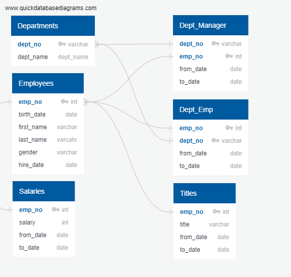

# Pewlett-Hackard-Analysis

## Overview of Project
As baby boomers begin to rapidly retire Pewlett Hackard is looking toward the future. They need to determine which positions will need to be filled in the near future. The number of upcoming retirements will leave thousands of job openings. We need to answer the follwoing questions.
1. Who will be retireing in the next few years.
2. How many positions will Pewlett Hackard nee to fill. 

Before we can answer those questions we want to map the relationship of our data tables and visualize them in a Entity Relationship Diagram (ERD). The ERD created for this project is shown below. 
